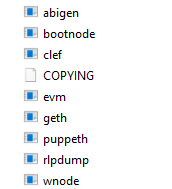
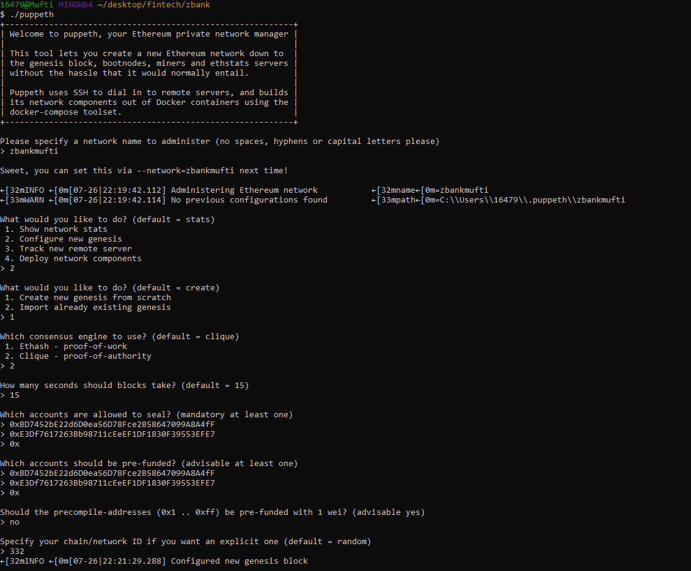

# Unit 18 Homework Assignment: Zbank Blockchain
- - -

#### Steps to set up and test Proof of Authority (POA) Blockchain

1) Download Geth and Tools from https://geth.ethereum.org/downloads/ and choose version 1.9.7.

2) Once download is completed, decompress files in your working folder directory. It should look something like this.

  

3) Now open your gitbash and go into the working directory. We are going to create our nodes.

  

4) Create accounts for two nodes on the network with a separate datadir for each using geth.

./geth --datadir node1 account new
./geth --datadir node2 account new

  

##### * Note: Rememeber to remember the password you used to create the nodes and keep the same password for each node. Furthermore copy both the public address and copy and paste the "Public address of the key" and "Path of the secret key file", this will be needed for mining.  

  

5) Open Gitbash and run puppeth in terminal to configure the test blockchain in the zbank folder.

./puppeth

6) Complete blockchain configuration by steps in the screen shot below.

  

  

##### You will see the below files created in your working directory

  

7) After configuring the genesis block, we can now initialize the nodes with the genesis json file with the following command.
##### Remember to add your own network name.

./geth --datadir node1 init networkname.json
./geth --datadir node2 init networkname.json

  

8) Time to mine! Now that the two nodes are initialized, they can now begin mining blocks. Use the commands below to start Node 1 and 2.

###### Node 1:

./geth --datadir node1 --unlock "0xBD7452bE22d6D0ea56D78Fce2B58647099A8A4fF" --mine --rpc --allow-insecure-unlock

##### Note: the password that was used to create the nodes 1 and 2 you will need to put that same password for each node for mining.

  

##### Note: Copy the "enode" for node 1 (highlighted in yellow)

###### Node 2: 

In a separate terminal window start Node 2 using the command below.

./geth --datadir node2 --unlock "E3Df7617263Bb98711cEeEF1DF1830F39553EFE7" --mine --port 30304 --bootnodes "enode://0d25104b8679aa052f23a953a35e84e5e616afbf45c75eeb791a3f90feeb63404db52df613c028403e545036d48b8ad85f92e58bd86591d0b679e9015af91efd@127.0.0.1:30303" --ipcdisable --allow-insecure-unlock

  

9) Once both your nodes are working open MyCrypto app and add custom node 

  

10) It is time to send some ETH. Using our custom network (make sure you have selected this network) we will send a transaction between two accounts. Choose Node 1 when using the Keystore option.

  

11) On the top left "Send Ether & Tokens", make sure this option is selected. Now copy Node 2 address and paste it on the "To Address".
* Put the desired amount 
* leave the currency  "ETH"
* Transaction Fee "fast"
* Click on the "Send Transaction"

  

12) After clicking "send transaction" click on check TX status to see if it was succefully sent.

##### Note: your transaction may still show pending. Therfore stop both node 1 and 2 and MyCrypto. Relaunch the nodes and open the MyCrypto app and click on "TX Status"

13) The fianl result of your transaction.

  

